

<h1>🎤 아이랑 진짜 놀자! 
온라인 놀이방 프로젝트 나랑노랑</h1>

### 나랑노랑은 웹RTC를 통해 아이와 보호자가 놀이를 통해 교감하며 행복한 추억을 남길 수 있는 온라인 놀이방 서비스를 제공하는 웹기술 프로젝트입니다.

### 나랑노랑에서 아이와 함께 놀며, 아이에게 최고의 순간을 선물하세요:)

### 👉[나랑노랑을 직접 즐기고 싶다면?](https://i9c208.p.ssafy.io/)👈

 

## 목차

#### [1️⃣프로젝트 기간](#프로젝트-기간)

#### [2️⃣팀 소개](#-팀-소개)

#### [3️⃣기획배경 및 타겟](#-기획배경-및-타겟)

#### [4️⃣나랑노랑 서비스화면](#-나랑노랑-서비스화면)

#### [5️⃣기능구현](#-기능구현)

#### [6️⃣사용기술스택](#-사용기술스택)

#### [7️⃣시스템아키텍쳐](#-시스템-아키텍쳐)

#### [8️⃣산출물](#-산출물)

#### [9️⃣협업툴](#-협업툴)

 

## 프로젝트 기간

### 2023.07.03. ~ 2023.08.18.

 

## ✨ 팀 소개

|   **Name**   |               양지혜                |               위효선                |               서현영                |               곽강한                |               이찬웅                |               송아람                |
| :----------: | :---------------------------------: | :---------------------------------: | :---------------------------------: | :---------------------------------: | :---------------------------------: | :---------------------------------: |
| **Profile**  |  |  |  |  |  |  |
| **Position** |        **Team   Leader**         |      **Frontend   Leader**       |       **Backend   Leader**       |     **Backend   Developer**      |     **Release   Developer**      |     **Backend   Developer**      |

 

## ✨ 기획배경 및 타겟

### 기획배경

<h4>아이들은 보호자와 함께 놀며 교감할 때 가장 큰 행복을 느낍니다. 그러나 보호자가 생각하는 놀이와 아이가 생각하는 놀이의 개념은 사뭇 다릅니다. </h4>
<h4>나랑노랑은 웹RTC를 통해 장소에 구애받지 않고 아이와 보호자가 함께 게임을 즐기고 소통할 수 있는 장을 마련하였습니다.</h4>
<h4 style="color: darkgoldenrod"> 나랑노랑을 통해 아이에게 최고의 순간을 선물해주세요:) </h4>

### 이런 분께 추천합니다👍

**🤱 아이가 여럿이라 오프라인 활동이 어려운 가정**  
**👶 아이와 함께 신선하고 재미있는 게임을 하며 행복한 추억을 남기고 싶은 가정**

### 🎮 게임소개

- **날따라해봐요**
- **그대로 멈춰라**
- **유튜브API를 통한 다양한 어린이 체조**

 

## 👀 나랑노랑 서비스화면

<h3>메인페이지</h3>

| 나랑노랑 |
| :------: |

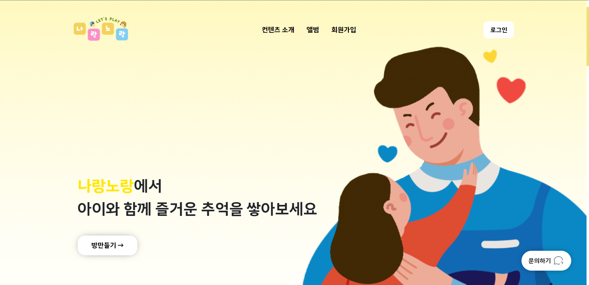

 

<h3>회원관리</h3>

|                   회원가입                    |                   로그인                    |
| :-------------------------------------------: | :-----------------------------------------: |
| 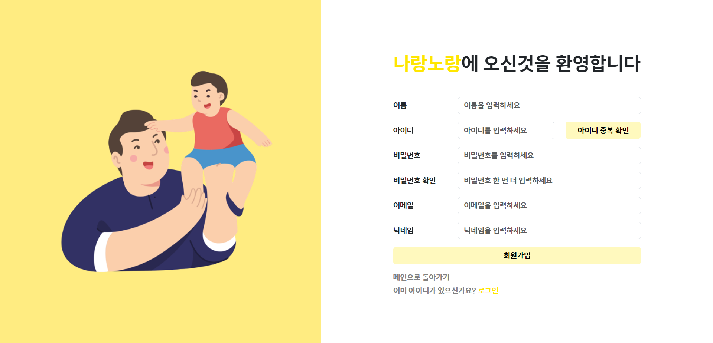 | 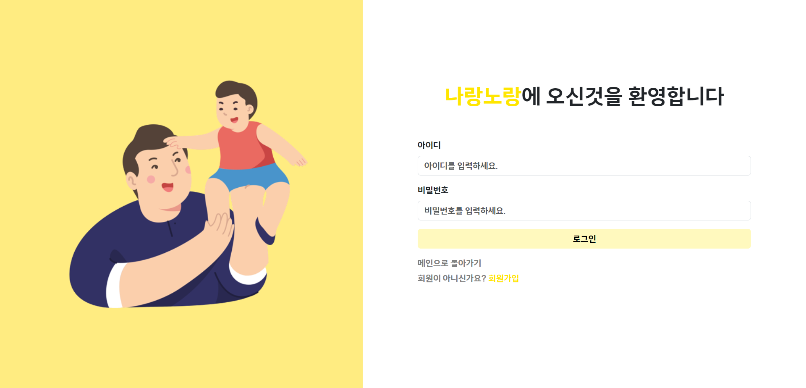 |

|               마이페이지                |
| :-------------------------------------: |
|  |

 

<h3>놀이공간</h3>

| 방 생성 |
| :-----: |

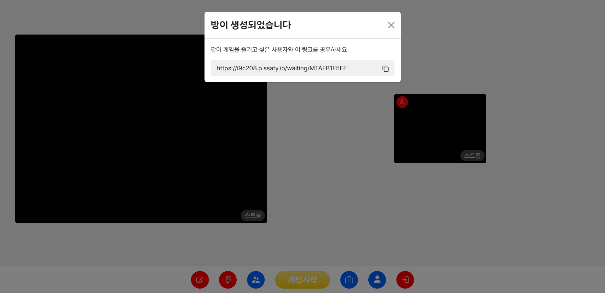

|                  카메라 off                   |                  마이크 off                   |
| :-------------------------------------------: | :-------------------------------------------: |
| 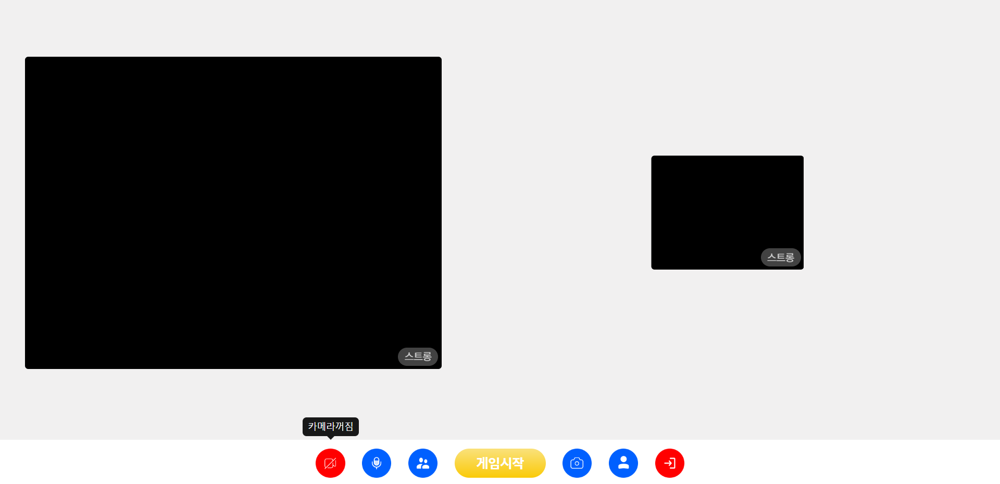 | 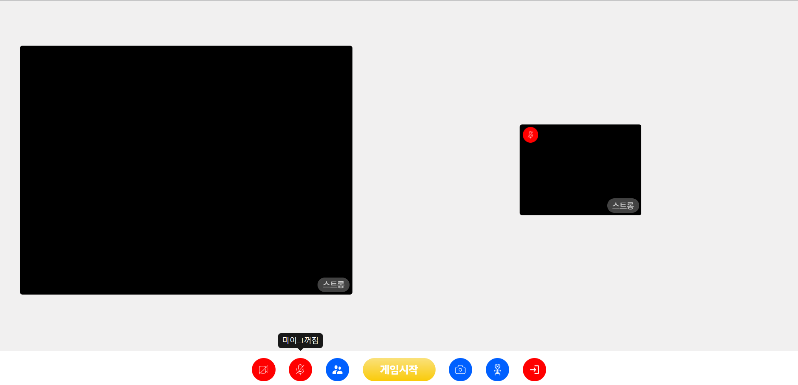 |

 

<h3>게임화면</h3>

|              게임 선택 화면               |                 게임 중 화면                 |
| :---------------------------------------: | :------------------------------------------: |
| 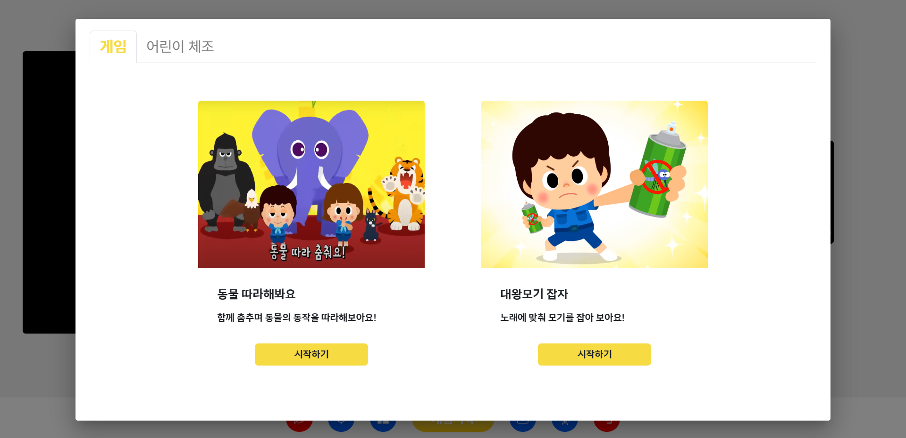 | 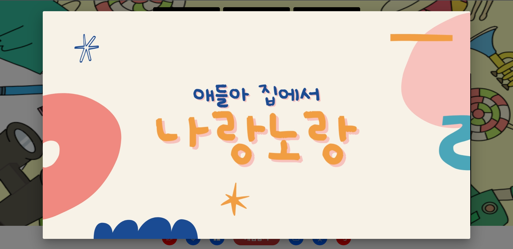 |

|                   체조화면                   |               우승화면                |
| :------------------------------------------: | :-----------------------------------: |
| 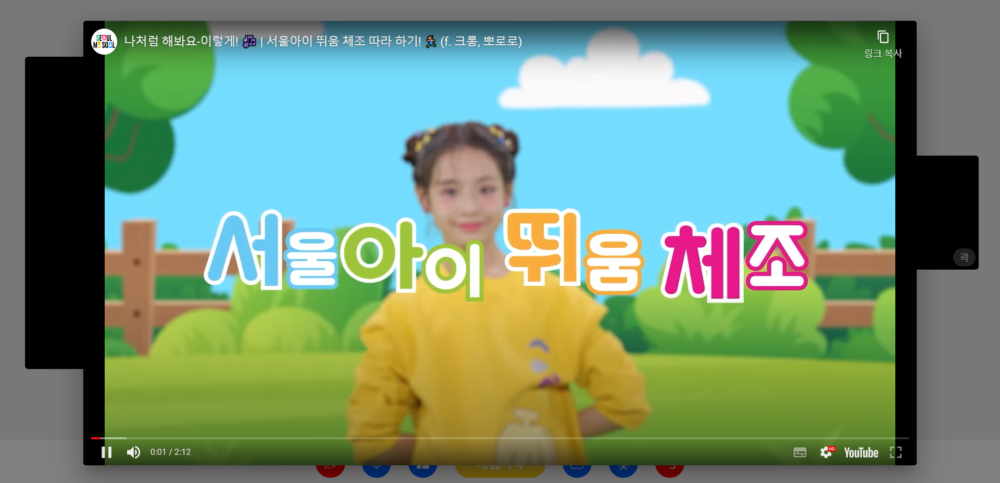 |  |

| XRAY MODE |
| :-------: |

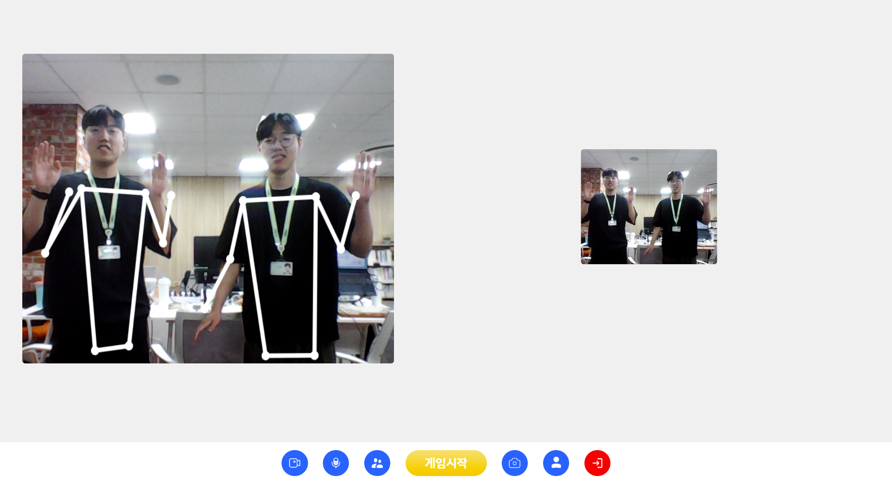

 

<h3>앨범</h3>

|               사진 선택화면               |                 앨범페이지                  |
| :---------------------------------------: | :-----------------------------------------: |
|  |  |

 

 

## 🔨 기능구현

### 서비스 설명 : 아이와 어른이 한데 모여 함께 놀며 추억을 쌓을 수 있는 온라인 놀이방

### 주요 기능

- webRTC를 통한 여럿이 즐길 수 있는 실시간 게임, 체조 영상 제공
- **Pose Detection을 통해 자세를 인식하고 이를 바탕으로 동작 유사도를 계산하여 점수 산출**
- 사용자가 게임을 즐기고 있는 모습을 캡쳐하고 기록을 원하는 사용자에게 앨범 제공

### AI

- tfjs 라이브러리를 통해 PoseNet 모델 이용
- **cosine similarity 계산을 통해 점수 산출**

### Frontend

- 회원관리, 로그인, 마이페이지 등 회원관리 유효성 검사
- 메인페이지 로드 시 fade in 효과 구현
- 날따라해봐요 게임 구성 및 구현
- openvidu를 통한 webRTC 서비스 제공
- 방 초대 링크 생성, 카메라 on/off, 마이크 on/off 등 툴바 기능 구현
- **캡처 기능을 구현해 앨범에 사진 저장 서비스 제공**

### Backend

- 회원관리, 앨범 사진 관리, 문의내역 관리
- **참여자 수, 게임 상태, 점수 관련 방 정보 저장 및 인원 제한, 게임 중 참여 불가 등 openvidu 방 관리**
- Swagger/OpenAPI를 이용하여 API 명세서 구현

 

## 📚 사용기술스택

<!-- - FrontEnd
    - React
    - reduxjs/toolkit
    - styled-components
- Backend
    - Database: Mysql
    - Web: Springboot
    - Library: Spring JPA, Spring Security, OpenVidu
- CI/CD
    - Docker
    - Jenkins
- Web Service
    - AWS EC2
    - Nginx
 -->

| Tech         | Stack                                  |
| ------------ |----------------------------------------|
| **Language** | Java, JavaScript                       |
| **Backend**  | Spring Boot, JPA, Spring Security, JWT |
| **Frontend** | React, reduxjs/toolkit                 |
| **Database** | MySQL, Redis                           |
| **Server**   | AWS EC2, NginX                         |
| **DevOps**   | Git, Docker                            |
| **WebRTC**   | openvidu                               |

 

## 🔨 시스템 아키텍쳐

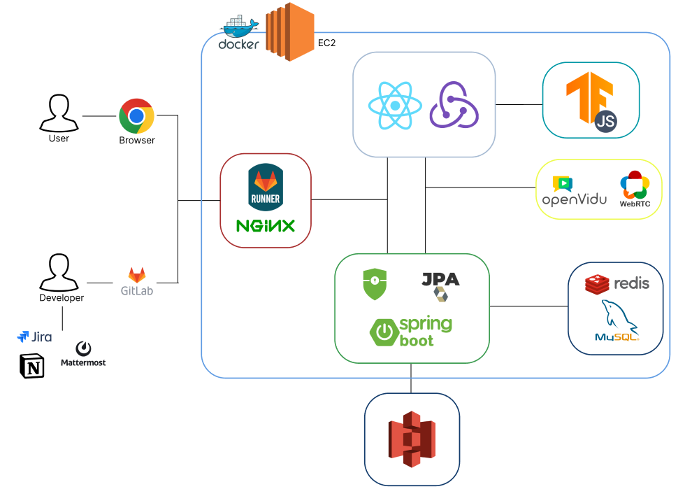

 

## 📄 산출물

<!-- ### ERD

### UML 유스케이스
 -->

|                  🎨 ERD                   |                UML 유스케이스                |
| :---------------------------------------: | :------------------------------------------: |
|  |  |

## 💪 협업툴

|             Notion             |            Jira            |             GitLab             |                  Figma                   |               MatterMost               |
| :----------------------------: | :------------------------: | :----------------------------: | :--------------------------------------: | :------------------------------------: |
|  |  |  |  |  |
