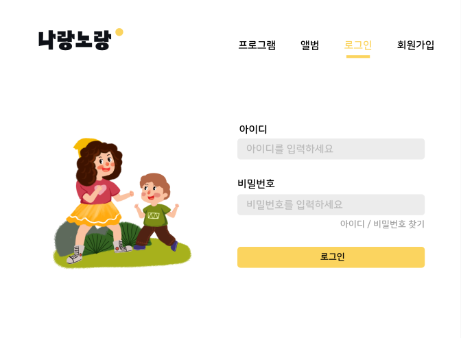

## 23/07/24 (월)
 

### 디자인 기획 및 와이어프레임 작성

  1. 디자인 참고 정리
  - [노션페이지](https://www.notion.so/029bb64b7d584e9aa7d60a6c3207a2eb?pvs=4)
  - [핑크퐁 홈페이지](https://www.pinkfong.com/ko/)
  - [EBS kids 홈페이지](https://www.ebs.co.kr/kids)
  - [와이키즈 홈페이지](https://whykids.co.kr/?utm_source=google_pc&utm_medium=sa&utm_campaign=whykids23&utm_term=)
   
  2. 로고 디자인
  
   
  
   
  3. figma 작성
  - 메인 페이지
   
  
   
  - 로그인 페이지
   
  