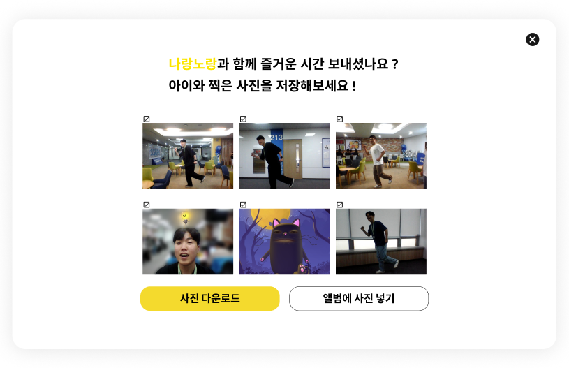

## 23/07/24(월)
<br />

### 디자인 기획 및 와이어프레임 작성

  1. 디자인 참고 정리
  - [노션페이지](https://www.notion.so/029bb64b7d584e9aa7d60a6c3207a2eb?pvs=4)
  - [핑크퐁 홈페이지](https://www.pinkfong.com/ko/)
  - [EBS kids 홈페이지](https://www.ebs.co.kr/kids)
  - [와이키즈 홈페이지](https://whykids.co.kr/?utm_source=google_pc&utm_medium=sa&utm_campaign=whykids23&utm_term=)
  <br />
  2. 로고 디자인
  <br />
  
  <br />
  
  <br />
  3. figma 작성
  <br />
  - 메인 페이지
  <br />
  
  <br />
  - 로그인 페이지
  <br />
  

<br />

## 23/07/25(화) - 23/07/26(목)
<br />

### figma 작성
1. 필요한 화면 구성 정리
  ```
  주의
  - 방 제외 하고 모든 페이지에 qna 아이콘(?)
  - 사이즈 조절 필요
  
  페이지
  1 메인
  - 로고 변경
  - 내브바 디자인(?버튼식?눌렀을 때 효과)
  - 방만들기 버튼 디자인
  
  2 프로그램 소개(?튜토리얼)
  - 이름 변경
  
  3 앨범 
  - 폴라로이드(사진(날짜), 체크, 연필버튼(내용))
  - 내려받기 버튼
  - 페이지네이션
  - 삭제버튼
  
  4 로그인
  - dribble 참고
  
  5 아이디 찾기

  6 비밀번호 재발급

  7 회원가입

  8 방
  - 입장
  - 말할 때 표시
  - 배경색(흰색)
  - 버튼색(노랑+그 외 포인트 색상)
  - 사이드바(체조율동/게임)
  - 플레이 효과(카운트, 폭죽)
  - 순위
  - 게임 예시 -> 날 따라해봐요
  - 가이드모드
  - 초대(링크 모달)
  - 도움말
  - 게임 탭에서 게임 선택 후 현재 진행중인 게임 목록으로 변경

  9 마이페이지
  - 내정보조회 -> 수정(공란) / 회원탈퇴(버튼)
  - 문의내역 / 답변여부
  
  10 비밀번호 변경 페이지

  11 QnA 페이지
  - 모달창
  - 이메일 / 구분 / 내용
  
  12 입장대기페이지
  - 구글미트 페이지 느낌
  
  13 방 나간 후 페이지
  - 사진 고르기
  - 비회원 상태: 사진 내려받기만 가능(압축) -> 메인 페이지
  - 회원 상태: 사진 내려받기/앨범에 넣기 -> 앨범(앨범넣기 선택) or 메인 페이지
  ```
<br />

2. figma 전체 화면<br />


3. 메인 및 QnA 창<br />
<br />
<br />
<br />

4. 회원가입, 로그인, 마이페이지<br />
<br />
<br />

5. 마이페이지, 앨범<br />
<br />
<br />

6. 게임방에 초대 받아 접속한 후 화면<br />
<br />
<br />
<br />
<br />

7. 방장이 게임방을 만들었을 때 화면<br />
<br />
<br />

8. 게임 선택하기<br />
<br />
<br />
<br />

9. 게임중 화면<br />
<br />
<br />

10. 게임 후 사진 선택<br />
<br />
<br />

11. 내일 수정 및 보완이 필요한 부분
- footer 수정하기
- 닫기 등 버튼 통일하기
- 체조, 율동, 게임 이미지 변경하기
- 프로그램 소개 페이지
- 프로토타입 정리하기
- 게임 개인전/팀전 선택 방법
- 게임 선택 모달 색상 및 배경 색상 변경
- 팀전 순위 표시