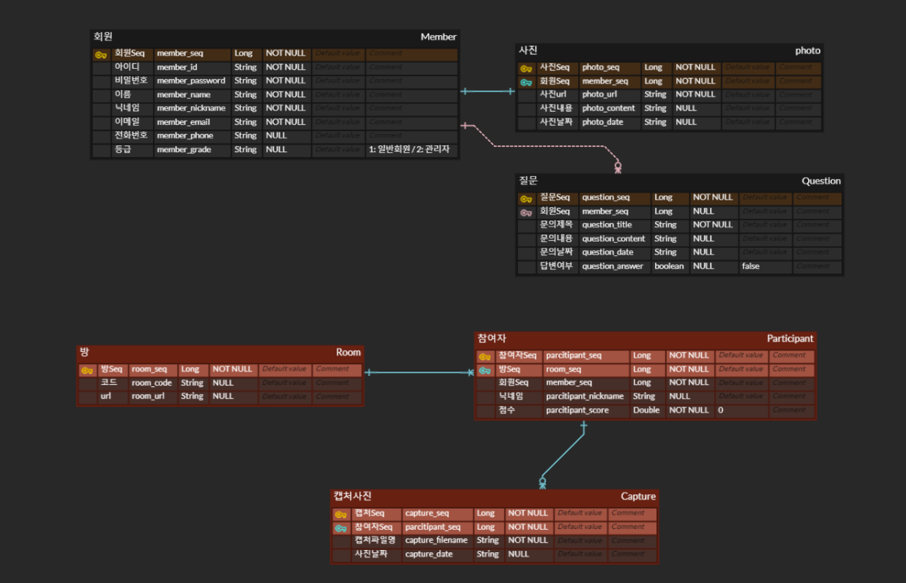
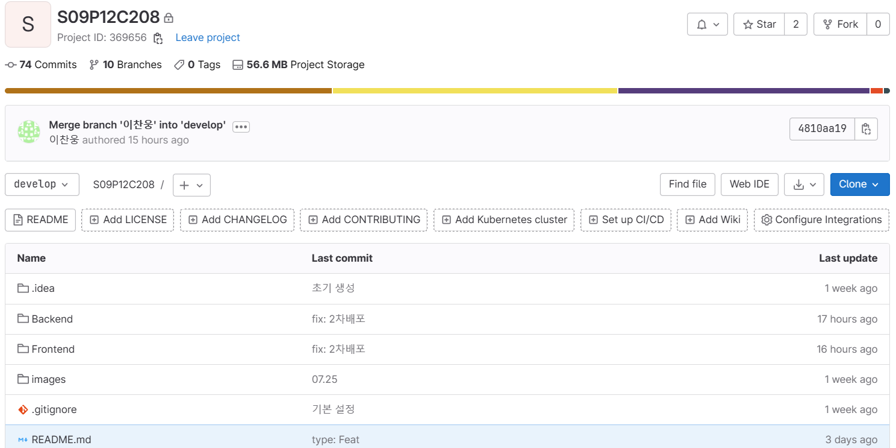

### "아이와 진짜 놀자, 온라인 놀이방 프로젝트"

 

### 🎤 나랑노랑 소개:
**온라인 놀이방 프로젝트: "나랑 노랑"** 은 웹기술 프로젝트로, 아이와 보호자가 함께 교감하고 일치감을 느낄 수 있는 게임을 웹RTC에서 실시간으로 같이 즐길 수 있도록 기능을 구현한 프로젝트입니다.
 

웹 사이트 링크: https://i9c208.p.ssafy.io/ 
 

## 목차
- [팀 소개](#팀소개)
- [발표자료](#발표자료)
- [UCC](#UCC)
- [기간](#기간)
- [기획배경 & 타겟](#target-people)  
- [기능구현](#기능구현)
- [사용기술스택](#사용기술스택)
- [스크린샷](#스크린샷)
- [산출물 및 협업툴](#산출물)

 

## ✨ 팀소개 
<!-- ( 깃헙아이디 / 증명사진) 넣을지? -->

|   **Name**   |                양지혜                 |                위효선                |                  서현영                   |               곽강한                |                 이찬웅                  |               송아람                |
| :----------: | :-----------------------------------: | :----------------------------------: | :---------------------------------------: | :---------------------------------: | :-------------------------------------: | :---------------------------------: |
| **Profile**  |     |    |         |   |       |   |
| **Position** |          Team   Leader           |          Frontend   Leader           |            Backend   Leader         |        Backend   Developer         |            Release   Developer              |         Backend   Developer         |

 

## 발표자료
<!-- [다운로드](data/공통PJT_구미_1반_D104_비피.pptx) (*.pptx) -->

 

## UCC
<!--  -->

 

## 기간
2023.07.03. ~ 2023.08.18.

 

### ✔️ 기획배경 & 타겟 
- 기획배경:
    1. 아이들의 행복한 순간은 보호자와 함께 하며 교감할 때이다.
    2. 보호자가 생각하는 놀이와 아이가 생각하는 개념이 다르다.
    3. 웹RTC 통해 집에서도 아이와 보호자가 함께 즐길 수 있는 게임과 소통의 장을 마련
    
- 타겟층 : 
    - 아이가 여럿이라 오프라인 활동이 어려운 가정
    - 아이와 함께 신선하고 재미있는 게임을 통해 사이가 좋아지고 싶은 가정

- 게임소개 :
    - 날따라해봐요
    - 그대로 멈춰라
    - 유튜브API를 통한 다양한 어린이 체조

## 기능구현

- Back-end
    - 회원가입, 로그인, 회원정보 조회, 회원정보 수정, 회원탈퇴, 아이디 찾기, 비밀번호 찾기, 이용자별 사용 로그기록 조회
    - 회원가입 시 우체국DB의 주소정보를 이용하여 도/시, 시/군/구, 동/군/리별 사용자 주소정보 기록 
    - 네이버 클라우드 플랫폼의 SMS API와 OpenWeatherAPI를 이용하여 날씨 알림 전송
    - 관리자 페이지에 각종 통계정보 제공 (일별 및 월별 수익현황, 지점별 최고 및 최저 매출, 지점별 수익현황 및 대여회수 등)
    - 사용자 정지 및 이용자별 사용 로그기록 조회, 사용자 이용기록별 반납사진 조회
    - 우산 대여지점 확인, 지점별 우산 수량
    - 반납시 ONNX 기반 YOLOv3의 우산 데이터를 활용하여 이미지 분석 후 우산 Object 확인
    - OpenWeatherAPI를 이용한 날씨정보 제공
    - BootPay를 이용하여 대여 및 반납, 환불 프로세스 제공
    - Swagger/OpenAPI를 이용하여 API 명세서 구현
- Front-end
    - 키오스크 대여/반납/날씨정보 제공
    - react-qr 이용하여 QR코드 카메라 인식
    - BootPay 연동
    - KakaoMap을 이용하여 키오스크 현황 제공
    - D3.js를 이용하여 관리자 통계정보 제공 (수익추이, 사용횟수, 사용자별 이용내역, 사용자 계정정보 관리)
    - Back-end에서 제공한 JWT 토큰을 이용해서 로그인 구현

 

## 📚 사용기술스택 (확인 필요)

- Front-End:
    - React
    - reduxjs/toolkit 
    - styled-components
- Backend
    - Database: Mysql
    - Web: Springboot
    - Library: Spring JPA, Spring Security, OpenVidu
- CI/CD
    - Docker
    - Jenkins
- Web Service 
    - AWS EC2
    - Nginx

| Tech         | Stack                                  |
| ------------ | -------------------------------------- |
| **Language** | Java, JavaScript                       |
| **Backend**  | Spring Boot, JPA, Spring Security, JWT |
| **Frontend** | React, reduxjs                         |
| **Database** | MariaDB                                |
| **Server**   | AWS EC2, NginX                         |
| **DevOps**   | Git, Docker                            |

#🔨  시스템 아키텍쳐

 

## 홈페이지 (한줄설명도 적가)

- <h5>메인페이지</h5>

| 방만들기 | 방화면 | 
|:----:|:----:|:----:|
|||
 

- <h5>회원 관리</h5>

| 로그인 | 회원가입 |
|:----:|:----:|
|||

| 마이페이지 | 
|:----:|:----:|
||
 

- <h5>게임 화면</h5>

| 대기화면 | 게임 중 화면 |
|:----:|:----:|
|||

| 체조화면 | 우승화면 |
|:----:|:----:|
|||

 

- <h5>앨범</h5>

| 사진 선택화면 | 앨범페이지 |
|:----:|:----:|
|||

 

 

## 산출물

| 🎨 ERD  | UML 유스케이스 |
|:----:|:----:|
|||

<!-- ### 💡 API 명세서

### 🗓️ 스케줄(간트차트) -> 번다운차트로 변경??
 -->

### 💪 협업툴 (표모양으로 만들기)

| Notion | Jira | GitLab | Figma | MatterMost |
|:----:|:---------:|:----------:|:---------:|:--------:|
||||| |